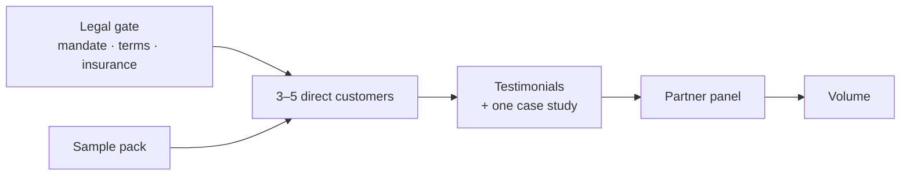

# Gameplan

## Where we are

**The thinking is done and the delivery method is proven.** A [working reference implementation](./operations/reference-implementation.md) exists, the [position](./market/differentiation.md) is settled, the [landscape](./market/competitors/landscape.md) is mapped, and there is [one warm partner](./go-to-market/sojourners-capital.md) whose clients are the target segment.

**Nobody has paid.** That is the whole of what is missing.

## The one question

> **Will a stranger pay for this?**

Delivery is the founder's strong ground — bespoke and manual by choice, retrieval by formal data request per provider, tooling added per edge case as customers arrive. Nothing on the critical path waits on technology.

## The critical path, and the trap in it

Distribution is [partner-led](./go-to-market/partners-and-distribution.md). That produces a dependency chain worth seeing in full:

**Partners want proof. Proof needs customers. Customers need the legal gate.** So the path to the most attractive channel starts with the least interesting task, and there is no way around it — a chartered firm lending its regulated reputation will ask about [insurance](./legal/liability.md), [terms](./legal/terms.md) and [compliance](./legal/compliance.md), and "not yet" ends that conversation.

## Two speeds

**One task has external lead time. Everything else is fast.**

| | Speed | Why |
| --- | --- | --- |
| [Legal gate](./legal/compliance.md) | **Weeks, not days** | Specialist advice, insurance underwriting and a [mandate](./legal/customer-mandate.md) that providers will actually accept — all involve other people's queues |
| Everything else | Days | Sample pack, offer, conversations, delivery — all within the founder's own control |

**So start the slow one first and run the fast ones alongside it.** The common failure is doing the enjoyable work first and discovering the queue afterwards.

## This week

1. **Start the legal gate.** Engage specialist UK data-protection advice and get [insurance](./legal/liability.md) quotes moving. It is first only because it has a queue — everything else can proceed while it runs.
2. **Talk to [Sojourner's Capital](./go-to-market/sojourners-capital.md).** Costs nothing, risks nothing, and answers the highest-value question available: *does medical history come up with your clients, unprompted or never?* Their answer reshapes the plan either way. **No referral ask.**
3. **Cut the [sample pack](./operations/sample-pack.md)** from the existing record.
4. **Ship [the first page](./website/homepage.md).** One page. A service handling the most sensitive data a person holds cannot have no web presence — it fails the search anyone does before replying, and no partner can point a client at nothing.

## The phases

| | What | Gate to pass |
| --- | --- | --- |
| **1. Sellable** | [Legal gate](./legal/compliance.md), [sample pack](./operations/sample-pack.md), a fixed [offer](./go-to-market/sales-motion.md) on [one page](./website/homepage.md) | A chartered firm's diligence would not stop you |
| **2. Proven** | 3–5 customers at full price from [warm network and communities](./go-to-market/first-customers.md) | **One stranger pays** |
| **3. Carried** | [Sojourner's panel](./go-to-market/sojourners-capital.md), then five more firms | **A partner sends someone** |
| **4. Repeatable** | More partners, [landing pages](./website/strategy.md), tooling per edge case | Partner-originated customers arrive without chasing |

Gate 2 is the real one. Everything before it is preparation and everything after it is scale.

## What has moved down the list

**The [operations](./operations/) docs are outputs, not inputs.** The retrieval playbook, delivery SOP and QA standard get written *from* the first deliveries rather than before them — a procedure designed in advance describes work that does not happen and misses work that does. The method is already proven on [one real record](./operations/reference-implementation.md); what remains is learning it for somebody else.

**[Labour economics](./go-to-market/labour-economics.md) is on watch.** It becomes decisive at the point of hiring or scaling. Hand-crafting is an accepted cost until then.

**The one operational unknown that is not deferrable** is acting as an agent for another person. Every document in the reference implementation was obtained as the data subject. That is what the [mandate](./legal/customer-mandate.md) exists to solve, and it sits inside the legal gate.

## What not to do now

Each of these is more comfortable than selling, which is what makes them dangerous rather than merely low-priority.

- **Do not refine this knowledge base further.** It is sufficient. Nothing in it converts a customer.
- **Do not build a customer-facing product.** Tooling follows real edge cases from real customers.
- **Do not build a publishing system.** Two pieces of writing, posted where publishing already works — see [publishing](./go-to-market/publishing.md).
- **Do not ask advisers for referrals yet.** Research conversations, yes.
- **Do not build a second page.** [One](./website/homepage.md) is necessary; the [thirteen-route backlog](./website/strategy.md) is a gate-4 concern.
- **Do not hire.**

## Related

- [Validation plan](./go-to-market/validation-plan.md) — the same path as a checklist
- [The first customers](./go-to-market/first-customers.md)
- [Thesis confidence](./market/thesis-confidence.md)
